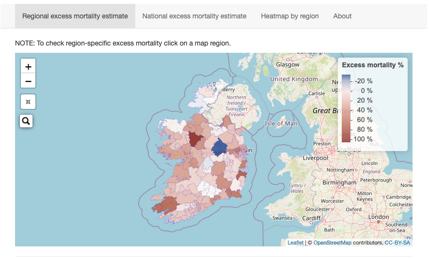

# Ireland's Excess Mortality App 

 This app is developed for tracking excess mortality in the Republic of Ireland. The excess mortality (p value) calculation is done following the method explained <a href='https://ourworldindata.org/excess-mortality-covid'> here</a>. 
 The data used by this app is scraped from RIP.ie on a daily basis enabling the app to provide near real-time information on excess mortality. However, please note that the data is not officially confirmed by authorities. 

